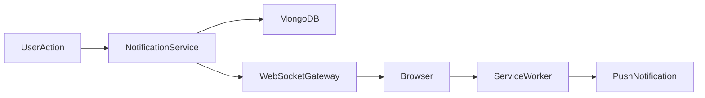
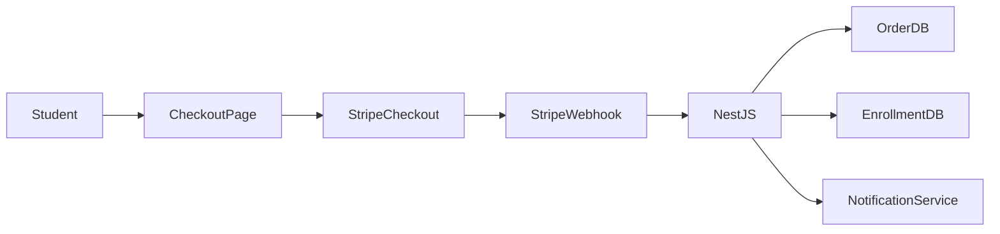
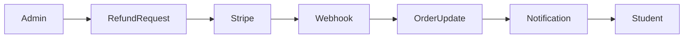

# LearnLocal: Hybrid E-Learning Management System (LMS)

LearnLocal is a progressive, full-stack educational web application designed for hybrid classrooms. It bridges online course delivery with offline physical classroom management at local educational centers. Designed with a decoupled architecture, it features a NestJS REST API, a Next.js 16 (React 19) frontend Progressive Web App (PWA), and MongoDB for flexible data modeling.

---

## 1. System Architecture

The platform separates the client-side Progressive Web App (PWA) sandbox from the enterprise-grade backend API, utilizing service workers for local storage, caching, and offline resilience.

```mermaid
graph TD
    %% Clients and Cache
    subgraph Client [Client Side / PWA Sandbox]
        UI[Next.js 16 App Router UI / React 19]
        SW[Service Worker / Workbox Runtime]
        LS[(Local Storage / Cache API)]
    end

    %% Network / API Gateway
    subgraph Backend [Backend Service / NestJS REST API]
        Controller[Controllers / REST API Router]
        Auth[JWT Guards & Roles Auth]
        Module[Modules / Business Logic]
    end

    %% Persistence
    subgraph Database [Persistence Layer]
        Mongoose[Mongoose ODM]
        MongoDB[(MongoDB Database)]
    end

    %% External Services
    subgraph External [External Services]
        Stripe[Stripe Gateway / Webhooks]
        Cloudinary[Cloudinary Asset Storage]
    end

    %% Flows & Connections
    UI -->|1. Render / Request| SW
    SW -->|Cache Hit| LS
    SW -->|Cache Miss / API Query (Axios JWT)| Controller
    Controller -->|2. Authorize| Auth
    Auth -->|3. Route Request| Module
    Module -->|4. Query / Write| Mongoose
    Mongoose --> MongoDB
    Module -->|5. Charge / Webhook| Stripe
    Module -->|6. Upload / Stream| Cloudinary
```

### Core Technology Stack

*   **Frontend Ecosystem:**
    *   **Framework:** [Next.js 16](https://nextjs.org/) (App Router, React 19, TypeScript)
    *   **Styling:** [Tailwind CSS v4](https://tailwindcss.com/) & [DaisyUI v5](https://daisyui.com/) (modern typography, dark aesthetics, touch targets)
    *   **State & Caching:** [TanStack Query v5](https://tanstack.com/query) & [Axios](https://axios-http.com/)
    *   **Internationalization:** [next-intl](https://next-intl-docs.vercel.app/)
    *   **PWA Manager:** `@ducanh2912/next-pwa` for service worker compiling and runtime caching
*   **Backend Ecosystem:**
    *   **Framework:** [NestJS 11](https://nestjs.com/) (TypeScript, dependency injection, decoupled modular layer)
    *   **Database ODM:** [Mongoose](https://mongoosejs.com/) with MongoDB
    *   **Authentication & Security:** Passport.js (JWT access/refresh token queueing strategy)
    *   **Third-Party Services:** Stripe (subscriptions/purchases) & Cloudinary (media upload & optimization)

---

## 2. User Roles & Permission Matrix

The application handles three user roles: `STUDENT`, `INSTRUCTOR`, and `ADMIN`. The following matrix outlines access privileges:

| Privilege / Action | Student | Instructor | Admin |
| :--- | :---: | :---: | :---: |
| View online courses, roadmaps, and lessons | Yes | Yes | Yes |
| Study lessons, complete quizzes, take notes | Yes | Yes | Yes |
| Purchase course enrollments and subscription plans | Yes | No | No |
| Create and edit modular curriculums (Courses, Lessons) | No | Yes | Yes |
| View student assignment submissions & write grades | No | Yes | Yes |
| Schedule physical cohorts & classrooms | No | Yes | Yes |
| Review & approve course blueprints before publication | No | No | Yes |
| Manage physical centers, classrooms, and capacities | No | No | Yes |
| Global user management (create, suspend, update roles) | No | No | Yes |
| Access financial metrics and revenue dashboards | No | No | Yes |

---

## 3. Dashboard Implementations

### Admin Dashboard
*   **Layout:** Collapsible persistent sidebar with global configurations. High-density information grid.
*   **Core Widgets & Views:**
    *   *Analytics Grid:* Summary cards showing total active students, global pass rate, ongoing physical cohorts, and platform revenue.
    *   *Instructor Leaderboard:* High-end table mapping total students per instructor, course counts, and user reviews.
    *   *System Control Center:* Dynamic forms to assign a course blueprint to a specific room or physically scheduled center tracking slot.

### Instructor Dashboard
*   **Layout:** Focus-driven dashboard emphasizing today's schedule (online/offline sessions) and grading actions.
*   **Core Widgets & Views:**
    *   *Cohort Timeline:* Visual list tracking active course sections with completion progress sliders.
    *   *Pending Review Hub:* Notification queue containing student assignment submissions requiring grades and written feedback.
    *   *Schedule Synchronization:* PWA-optimized interactive calendar mapping physical lecture hours to prevent classroom booking overlaps (renders analytics using **Recharts**).

---

## 4. Web Development Curriculum Roadmap Nodes

The platform maps educational roadmaps as sequential learning nodes using a premium dark aesthetic.

*   **Node 1: Modern Frontend Architecture (Foundations to Core)**
    *   *Concepts:* TypeScript Strict Mode, Semantic HTML5, Advanced CSS (Flexbox, Grid, Container Queries).
    *   *Core Stack:* React (Hooks, Concurrent Rendering, Server Components), Next.js App Router (Layouts, Routing, Loading states).
    *   *State & Styling:* Tailwind CSS, DaisyUI, component styling patterns, and asynchronous server caching via TanStack Query.
*   **Node 2: Enterprise Backend Architecture (Scalable Infrastructure)**
    *   *Concepts:* REST API Design, Dependency Injection, Middleware, Interceptors, Pipes, and Guards.
    *   *Core Stack:* NestJS framework execution, Node.js environment optimization.
    *   *Data Layer:* MongoDB, document modeling, and Mongoose ODM integration.
    *   *Security:* JWT Access/Refresh tokens strategy, password cryptography with bcrypt, Cors, and Helmet integration.
*   **Node 3: Full-Stack Integration & Advanced AI (Production Ecosystem)**
    *   *Concepts:* Bidirectional data syncing, Edge deployment optimization, and intelligent asset caching.
    *   *Core Stack:* Next.js Server Actions combined with NestJS enterprise backend microservices.
    *   *PWA Core:* Service Workers setup (`next-pwa` configuration), `manifest.json` generation, offline asset caching strategy, and progressive standalone window detection.

---

## 5. PWA & Offline Strategy

To deliver a seamless application experience, the frontend incorporates a two-layer service worker strategy:

### Caching Strategies
1.  **Cache First**: Applied to core static assets (fonts, icons, styles, next compiled chunks). This ensures fast initial loading and immediate UI layout rendering.
2.  **Network First**: Applied to dynamic API endpoints (course catalogs, progress percentages, lessons). If the network is unavailable, the service worker falls back to the last cached JSON response.
3.  **Document Fallback**: Automatically serves `/offline.html` from cache when a user navigates to an uncached page while disconnected.

### Offline Actions & Synchronization
*   **Lesson Progress**: Students can mark lessons as complete while offline. The progress percentage is computed locally, saved to `localStorage`, and synced to the NestJS API automatically when network connection is restored.
*   **Study Notes**: Markdown-compatible text study notes are persisted directly to the client's `localStorage` sandbox per course and lesson.

---

## 6. Responsive Design System Principles

*   **Mobile-First Approach**: Components scale from mobile viewports (`375px` to `430px`) up to desktop ultrawide monitors (`1920px+`).
*   **Flexible Structural Layouts**: Grid and Flexbox layouts dynamically adapt without rigid pixel constraints (using classes like `grid-cols-1 md:grid-cols-2 lg:grid-cols-3` or `flex-col md:flex-row`).
*   **Touch Targets**: Interactive buttons, navigation items, and forms maintain a minimum target area of `44x44px` on mobile viewports for compliance with mobile accessibility guidelines.

---

## 7. Database Schema Mapping (Mongoose)

All database entities are modeled under [backend/src/schemas](file:///c:/Projects/E-Learning/backend/src/schemas) and exported in [index.ts](file:///c:/Projects/E-Learning/backend/src/schemas/index.ts):

*   **[User](file:///c:/Projects/E-Learning/backend/src/schemas/user.schema.ts):** Establishes credentials, avatar, bio, and role (`STUDENT`, `INSTRUCTOR`, `ADMIN`) along with `suspended` flags.
*   **[Course](file:///c:/Projects/E-Learning/backend/src/schemas/course.schema.ts):** Represents metadata, pricing details, discount rates, category/instructor mappings, tag arrays, and verification publication flags.
*   **[Lesson](file:///c:/Projects/E-Learning/backend/src/schemas/lesson.schema.ts):** Maps instructional content, video URLs, markdown content, duration (minutes), order weight, and free previews.
*   **[Submission](file:///c:/Projects/E-Learning/backend/src/schemas/submission.schema.ts):** Captures student programming assignments, grading statuses (`PENDING`, `GRADED`), grade numeric scores, and instructor feedback text.
*   **[Center](file:///c:/Projects/E-Learning/backend/src/schemas/center.schema.ts):** Configures physical centers containing nested **Classroom** objects representing capacities.
*   **[Enrollment](file:///c:/Projects/E-Learning/backend/src/schemas/enrollment.schema.ts):** Links users and courses. Features compound index on `{ userId, courseId }` to guarantee unique enrollments.
*   **[Review](file:///c:/Projects/E-Learning/backend/src/schemas/review.schema.ts):** Stores rating stars (1-5) and written student reviews.
*   **[Meeting](file:///c:/Projects/E-Learning/backend/src/schemas/meeting.schema.ts):** Virtual meeting scheduling objects containing start/end date-times and video meeting URLs.
*   **[Order](file:///c:/Projects/E-Learning/backend/src/schemas/order.schema.ts):** Tracks financial transactions with payment status (`PENDING`, `PAID`, `FAILED`, `REFUNDED`) and corresponding Stripe Session IDs.
*   **[MembershipPlan](file:///c:/Projects/E-Learning/backend/src/schemas/membership-plan.schema.ts):** Configures subscription plans (e.g., Monthly/Annual) and their feature strings.
*   **[Membership](file:///c:/Projects/E-Learning/backend/src/schemas/membership.schema.ts):** Connects a user to an active `MembershipPlan` along with expiration timestamps.
*   **[BlogPost](file:///c:/Projects/E-Learning/backend/src/schemas/blog-post.schema.ts):** Formats posts with tag arrays, read counts, and publishing timestamps.
*   **[Message](file:///c:/Projects/E-Learning/backend/src/schemas/message.schema.ts):** Stores real-time chat interactions between mentors/instructors and students.
*   **[Category](file:///c:/Projects/E-Learning/backend/src/schemas/category.schema.ts):** Defines global tags mapping categories to icons (e.g., Code, Palette, Camera).
*   **[Tag](file:///c:/Projects/E-Learning/backend/src/schemas/tag.schema.ts):** Lightweight course categorization labels.

---

## 8. Folder & Module Structure

```
E-Learning/
├── docker-compose.yml       # Docker Compose setup for local MongoDB instance
├── backend/
│   ├── src/
│   │   ├── common/          # Passport strategies, guards, and custom route decorators
│   │   │   ├── decorators/  # Public route/role configuration annotations
│   │   │   └── guards/      # JWT Authentication & authorization execution classes
│   │   ├── modules/         # Controllers, services, and modules for features
│   │   │   ├── admin/       # Administrator metrics & approval controllers
│   │   │   ├── auth/        # Register, login, and jwt token refresh modules
│   │   │   ├── seed/        # Database seed initializers (users, courses, classes)
│   │   │   └── ...          # courses, enrollments, blog, meetings, payments modules
│   │   ├── schemas/         # Mongoose schema modeling index and files
│   │   └── main.ts          # Backend NestJS entry point file
│   ├── package.json         # Server dependency details (NestJS 11, Stripe, Cloudinary)
│   └── .env                 # Server env settings (database connection strings, secrets)
└── frontend/
    ├── app/                 # Next.js App Router directories
    │   ├── [locale]/        # Localized subdirectories managing translations
    │   │   ├── admin/       # Admin configurations dashboard view folder
    │   │   ├── instructor/  # Instructor dashboard (cohorts, review list, calendar)
    │   │   └── ...          # courses view, profile, roadmap nodes pages
    │   ├── globals.css      # Core tailwind CSS properties stylesheet
    │   └── layout.tsx       # Root next.js layout wrapper
    ├── components/          # Reusable view layout blocks (Navbar, Footer, Providers)
    ├── contexts/            # Application state contexts
    │   └── auth-context.tsx # Session tracking context handler
    ├── lib/                 # Core helper classes
    │   └── api.ts           # Interceptor-driven client api client instances
    ├── package.json         # Front dependencies (React 19, Recharts, TanStack Query)
    └── next.config.ts       # Next config with service worker specifications
```

---

## 9. Local Setup & Execution

### 1. Prerequisites
*   Node.js (v18 or newer)
*   Docker (Optional, for spinning up MongoDB)

### 2. Run Database
Start a local MongoDB container via:
```bash
docker compose up -d
```
*   This initiates MongoDB listening on port `27017` locally.

### 3. Backend Setup
1.  Navigate to the backend:
    ```bash
    cd backend
    ```
2.  Install dependencies:
    ```bash
    npm install
    ```
3.  Configure variables by creating [backend/.env](file:///c:/Projects/E-Learning/backend/.env):
    ```env
    PORT=3001
    MONGO_URI=mongodb://localhost:27017/elearning
    JWT_SECRET=your_jwt_secret_key
    STRIPE_SECRET_KEY=sk_test_...
    CLOUDINARY_CLOUD_NAME=...
    CLOUDINARY_API_KEY=...
    CLOUDINARY_API_SECRET=...
    ```
4.  Start development:
    ```bash
    npm run start:dev
    ```
    *   **REST API:** `http://localhost:3001`
    *   **Swagger API Docs:** `http://localhost:3001/api/docs`

### 4. Database Seeding & Mock Accounts
The database automatically seeds when the NestJS application starts if documents do not exist (initialized in [seed.service.ts](file:///c:/Projects/E-Learning/backend/src/modules/seed/seed.service.ts)). 

The seed script registers these mock accounts for local development and review:

| Role | Username | Email | Password |
| :--- | :--- | :--- | :--- |
| **ADMIN** | `admin_master` | `admin@learnlocal.com` | `password123` |
| **INSTRUCTOR** | `john_mentor` | `mentor@learnlocal.com` | `password123` |
| **STUDENT** | `bob_student` | `bob@example.com` | `password123` |

### 5. Frontend Setup
1.  Navigate to the frontend:
    ```bash
    cd ../frontend
    ```
2.  Install dependencies:
    ```bash
    npm install
    ```
3.  Start Next.js development:
    ```bash
    npm run dev
    ```
    *   **Development Server:** `http://localhost:3000`

---

## 10. Developer Guidelines

### API Requests & JWT Interception
Always call external resources using the predefined client `api` instance in [api.ts](file:///c:/Projects/E-Learning/frontend/lib/api.ts). It automatically reads `access_token` from `localStorage`, attaches it to the authorization headers, and handles `401 Unauthorized` token refreshes asynchronously by talking to backend `/auth/refresh` endpoint and retrying the request.

```typescript
import { api } from '@/lib/api';

// Automatically includes authorization headers & handles JWT refresh:
const { data } = await api.get('/courses');
```

### Route Authentication & Authorization in NestJS
*   To expose a NestJS route publicly, use the `@Public()` decorator from [public.decorator.ts](file:///c:/Projects/E-Learning/backend/src/common/decorators/public.decorator.ts).
*   To protect controllers or specific routes by roles, combine `@UseGuards(JwtAuthGuard, RolesGuard)` and the `@Roles()` decorator:

```typescript
@UseGuards(JwtAuthGuard, RolesGuard)
@Roles('INSTRUCTOR', 'ADMIN')
@Controller('cohorts')
export class InstructorController {
  // Methods...
}
```

### Offline Styling Indicators
When developing UI components that depend on network connection, monitor connection status. Display subtle visual badges to alert students when they are browsing offline content powered by the cached fallback layer.

---

# 11. Notification & Payment System Architecture

## Notification System

The platform supports real-time and persistent notifications for students, instructors, and administrators.

### Notification Types

| Event                | Student | Instructor | Admin |
| -------------------- | ------- | ---------- | ----- |
| Course Enrollment    | ✓       | ✓          | ✓     |
| Payment Success      | ✓       | ✗          | ✓     |
| Payment Failed       | ✓       | ✗          | ✓     |
| Assignment Submitted | ✗       | ✓          | ✗     |
| Assignment Graded    | ✓       | ✗          | ✗     |
| New Course Published | ✓       | ✗          | ✗     |
| Meeting Scheduled    | ✓       | ✓          | ✗     |
| Membership Expiring  | ✓       | ✗          | ✓     |
| System Announcement  | ✓       | ✓          | ✓     |

### Notification Channels

* In-App Notifications (via Socket.IO & Mongoose [NotificationSchema](file:///c:/Projects/E-Learning/backend/src/schemas/notification.schema.ts))
* Push Notifications (PWA)
* Email Notifications
* Admin Broadcast Notifications

### Database Schema

```typescript
@Schema({ timestamps: true })
export class Notification {
  @Prop({ required: true })
  userId: string;

  @Prop({ required: true })
  title: string;

  @Prop({ required: true })
  message: string;

  @Prop({ default: false })
  read: boolean;

  @Prop({
    enum: [
      'PAYMENT',
      'COURSE',
      'ASSIGNMENT',
      'SYSTEM',
      'MEETING'
    ]
  })
  type: string;
}
```

### Real-Time Delivery

* NestJS WebSocket Gateway ([notifications.gateway.ts](file:///c:/Projects/E-Learning/backend/src/modules/notifications/notifications.gateway.ts))
* Socket.IO
* Redis Adapter (future scaling)
* Push API for PWA notifications

### Notification Flow



---

# Payment System

## Payment Features

### One-Time Purchases

* Course Enrollment
* Premium Workshops
* Physical Classroom Registration

### Subscription Plans

* Monthly Membership
* Annual Membership
* Corporate Plans

### Stripe Integration

#### Payment Flow



### Stripe Webhooks

Supported Events:

* checkout.session.completed
* invoice.paid
* invoice.payment_failed
* customer.subscription.created
* customer.subscription.updated
* customer.subscription.deleted
* charge.refunded

### Order Status Lifecycle

```text
PENDING
   ↓
PROCESSING
   ↓
PAID
   ↓
REFUNDED
```

Failed Flow:

```text
PENDING
   ↓
FAILED
```

### Payment Security

* Stripe Hosted Checkout
* JWT Protected APIs
* Webhook Signature Verification
* Idempotency Keys
* Rate Limiting
* Helmet Security Headers
* HTTPS Only

### Post-Payment Automation

After successful payment:

1. Verify Stripe webhook signature.
2. Update Order status to PAID.
3. Create Enrollment record.
4. Activate Membership if applicable.
5. Generate notification.
6. Send confirmation email.
7. Update analytics dashboard.

### Refund Flow



### Payment Analytics

Admin Dashboard Metrics:

* Total Revenue
* Monthly Revenue
* Active Subscriptions
* Failed Payments
* Refund Rate
* Average Order Value (AOV)
* Revenue per Course
* Revenue per Instructor

