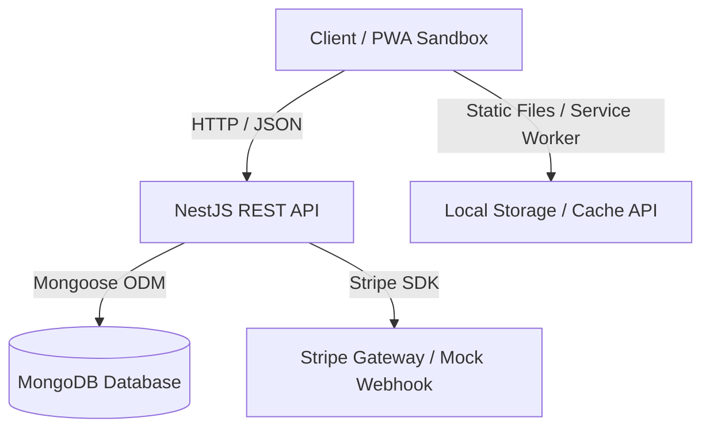

# LearnLocal Developer Guide & Technical Specification (`skill.md`)

This document outlines the system architecture, database design, user permissions, dashboard layouts, PWA offline configuration, curriculum roadmap nodes, and responsive design systems for the **LearnLocal Platform** — a Progressive Web App (PWA) educational platform supporting both online learning and local physical classrooms.

---

## 1. System Architecture

The platform is designed as a decoupled full-stack application:



### Technology Stack
*   **Frontend Framework:** Next.js 16 (App Router, React 19, TypeScript)
*   **Styling & UI:** Tailwind CSS (v4 inline mappings), Lucide Icons
*   **Data Fetching & State:** Axios (JWT Interception & Refresh Queue) + TanStack Query (React Query)
*   **Backend Framework:** NestJS (TypeScript, REST Controller structures)
*   **Database ODM:** Mongoose with MongoDB
*   **PWA Manager:** `@ducanh2912/next-pwa` for Service Workers & Runtime caching

---

## 2. User Roles & Permission Matrix

### A. Admin (Platform Administrator)
The Admin manages the entire platform infrastructure, local centers, finances, and global user management.
*   **Global Overview:** Monitor platform-wide metrics (total revenue, active enrollments, instructor performance).
*   **User Management:** Create, update, suspend, or change roles for Students, Instructors, and Sub-Admins.
*   **Inventory & Centers:** Manage physical/offline center details, classroom allocations, and capacity limits.
*   **Course Approval:** Review and approve or reject course blueprints submitted by instructors before publication.

### B. Instructor (Content Creator & Mentor)
The Instructor focuses on content delivery, localized physical schedules, student evaluations, and tracking course metrics.
*   **Course Creator:** Build modular curriculums (Sections, Lessons, Coding Tasks, Quiz Nodes).
*   **Attendance & Scheduling:** Schedule physical/offline cohort sessions at designated local center rooms and track attendance.
*   **Student Engagement:** Review assignments, give feedback, answer student discussion boards, and issue completion certificates.

---

## 3. Dashboard Implementations

### Admin Dashboard Specification
*   **Layout:** Collapsible persistent sidebar with global configurations. High-density information grid.
*   **Core Widgets & Views:**
    *   *Analytics Grid:* Summary cards showing total active students, global pass rate, ongoing physical cohorts, and platform revenue.
    *   *Instructor Leaderboard:* High-end table mapping total students per instructor, course counts, and user reviews.
    *   *System Control Center:* Dynamic forms to assign a course blueprint to a specific room or physically scheduled center tracking slot.

### Instructor Dashboard Specification
*   **Layout:** Focus-driven dashboard emphasizing today's schedule (online/offline sessions) and grading actions.
*   **Core Widgets & Views:**
    *   *Cohort Timeline:* Visual list tracking active course sections with completion progress sliders.
    *   *Pending Review Hub:* Notification queue containing student assignment submissions requiring grades and written feedback.
    *   *Schedule Synchronization:* PWA-optimized interactive calendar mapping physical lecture hours to prevent classroom booking overlaps.

---

## 4. Web Development Curriculum Roadmap Nodes
The platform represents courses as an interactive, step-by-step sequential node roadmap. This structural JSON map is visually rendered as connected path components using a premium dark aesthetic.

### Node 1: Modern Frontend Architecture (Foundations to Core)
*   **Concepts:** TypeScript Strict Mode, Semantic HTML5, Advanced CSS (Flexbox, Grid, Container Queries).
*   **Core Stack:** React (Hooks, Concurrent Rendering, Server Components), Next.js App Router (Layouts, Routing, Loading states).
*   **State & Styling:** Tailwind CSS, Shadcn/UI component styling patterns, and asynchronous server caching via TanStack Query.

### Node 2: Enterprise Backend Architecture (Scalable Infrastructure)
*   **Concepts:** REST API Design, Dependency Injection, Middleware, Interceptors, Pipes, and Guards.
*   **Core Stack:** NestJS framework execution, Node.js environment optimization.
*   **Data Layer:** PostgreSQL management, relational database modeling, and Prisma ORM integration (migrations, seeding, complex queries).
*   **Security:** JWT Access/Refresh tokens strategy, password cryptography with bcrypt, Cors, and Helmet integration.

### Node 3: Full-Stack Integration & Advanced AI (Production Ecosystem)
*   **Concepts:** Bidirectional data syncing, Edge deployment optimization, and intelligent asset caching.
*   **Core Stack:** Next.js Server Actions combined with NestJS enterprise backend microservices.
*   **PWA Core:** Service Workers setup (`next-pwa` configuration), `manifest.json` generation, offline asset caching strategy, and progressive standalone window detection.

---

## 5. Responsive Design System Principles
*   **Mobile-First Approach:** Build components scaling from mobile dimensions (`375px` to `430px`) up to desktop ultrawide monitors (`1920px+`).
*   **Grid and Flexbox Controls:** Avoid rigid pixel dimensions for structural containers. Use Tailwind utilities: `grid-cols-1 md:grid-cols-2 lg:grid-cols-3` or `flex-col md:flex-row`.
*   **Touch Targets:** Ensure interactive buttons, navigation items, and forms maintain a minimum target area of `44x44px` on mobile viewports to comply with mobile accessibility standards.

---

## 6. PWA & Offline Strategy

To provide seamless offline capabilities, the frontend incorporates a two-layer service worker strategy:

### Caching Strategies
1.  **Cache First**: Used for static assets (fonts, icons, styles, next chunks). This ensures fast page loading times and allows core UI layouts to render immediately.
2.  **Network First**: Used for API routes (course catalogs, progress percentages, lessons). If the network is unavailable, the service worker falls back to the last cached JSON response.
3.  **Document Fallback**: Configured to serve `/offline.html` from cache when a user navigates to an uncached page while disconnected.

### Offline Actions
*   **Lesson Progress**: Students can mark lessons complete while offline. The progress percentage is computed locally, saved to `localStorage`, and synced to the NestJS API automatically upon connection restoration.
*   **Study Notes**: Text study notes are persisted directly to the client's `localStorage` sandbox per course and lesson.

---

## 7. Database Schema Mapping (Mongoose)

All data objects are modeled using Mongoose schemas:

*   **User**: email, username, passwordHash, role (`STUDENT`, `INSTRUCTOR`, `ADMIN`), avatar, bio.
*   **Course**: slug, title, description, thumbnail, price, discountPrice, categoryId, instructorId, published, tags.
*   **Lesson**: courseId, title, content, videoUrl, order, duration, isFree.
*   **Enrollment**: userId, courseId, progress, completedAt (Indexed compound unique).
*   **Review**: userId, courseId, rating (1-5), comment.
*   **BlogPost**: slug, title, body, thumbnail, authorId, tags, views, publishedAt.
*   **Meeting**: title, description, courseId, hostId, startAt, endAt, roomUrl.
*   **Order**: userId, courseId, amount, status (`PENDING`, `PAID`, `FAILED`, `REFUNDED`), stripeId.
*   **MembershipPlan**: name, price, interval (`month`, `year`), features.
*   **Membership**: userId, planId, status (`ACTIVE`, `EXPIRED`, `CANCELLED`), expiresAt.

---

## 8. Folder & Module Structure

```
E-Learning/
├── backend/
│   ├── src/
│   │   ├── common/              # Guards (JWT, Roles), Decorators (Public, Roles)
│   │   ├── modules/             # Auth, Users, Courses, Enrollments, Blog, Meetings, Payments
│   │   ├── schemas/             # Mongoose Entity Schemas index
│   │   └── main.ts              # CORS, Global Pipes, Swagger
│   └── .env                     # Database URIs, JWT Secrets
└── frontend/
    ├── app/                     # App Router pages (courses, blog, membership, offline)
    ├── components/              # Shared components (Navbar, Providers)
    ├── contexts/                # AuthContext session handlers
    ├── lib/                     # Axios API instance with JWT auto-refresh
    └── next.config.ts           # PWA Workbox runtime caching config
```

---

## 9. Local Setup & Commands

### Prerequisites
*   Node.js (v18+)
*   MongoDB Instance (or running MongoDB locally on port `27017`)

### Installation & Execution

#### 1. Database Start (Docker Option)
If using Docker, start MongoDB:
```bash
docker compose up -d
```

#### 2. Backend Setup
```bash
cd backend
npm install
# Configure your backend/.env values
npm run start:dev
```
*   **REST API:** `http://localhost:3001`
*   **Swagger API Docs:** `http://localhost:3001/api/docs`

#### 3. Frontend Setup
```bash
cd frontend
npm install
npm run dev
```
*   **Development Server:** `http://localhost:3000`

---

## 10. Development Guidelines

*   **API Invocations:** Always use the configured `api` instance from `@/lib/api`. It automatically manages JWT insertion and handles `401 Unauthorized` token refreshes behind the scenes.
*   **Route Protection:**
    *   To make a NestJS controller or route public, decorate it with `@Public()`.
    *   To restrict access to instructors or admins, decorate with `@Roles('INSTRUCTOR', 'ADMIN')` and place `@UseGuards(JwtAuthGuard, RolesGuard)` on the class or handler.
    *   Ensure roles are set properly during registration or update.
*   **Offline Styling:** Use the network state monitors in components to display visual badges reminding the user they are viewing cached offline contents.
